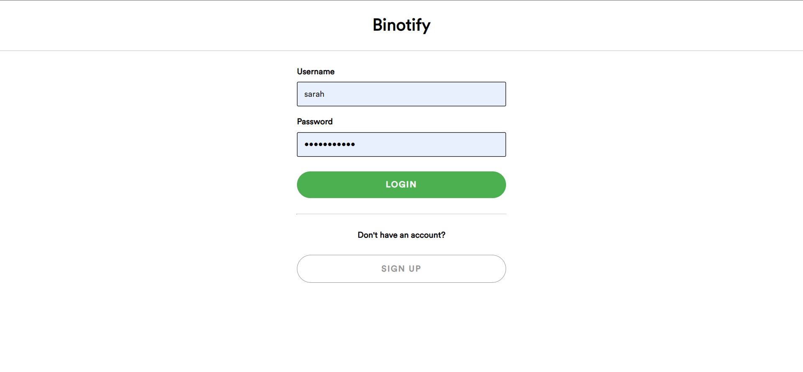
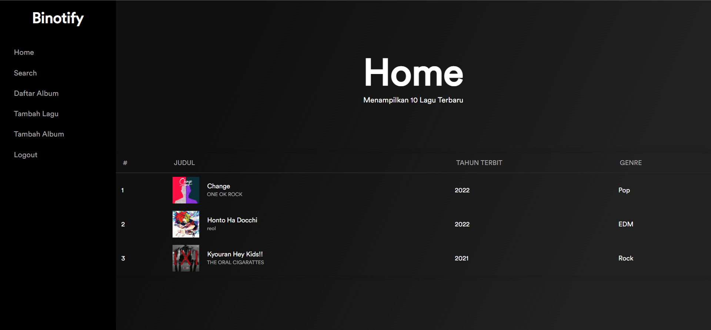
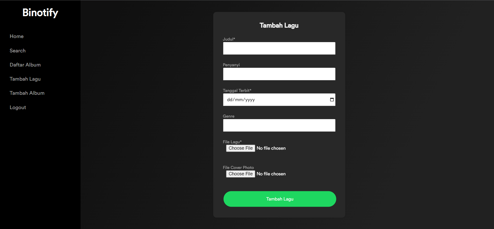

# Binotify: Web App Music Player

## Deskripsi aplikasi web

Monolithic PHP & Vanilla Web Application Music Player  
Aplikasi musik berbasis web yang dijalankan menggunakan sebuah DBMS MySQL dan PHP murni beserta HTML, CSS, dan Javascript vanilla.

## Daftar requirement

-   docker

## Cara instalasi

-   Pastikan telah menginstal docker, dapat diunduh secara bebas melalui internet
-   Clone repository dan ekstrasi
-   Rename file `.env.example` menjadi `.env`

## Cara menjalankan server

-   Arahkan ke folder hasil ekstraksi
-   Jalankan perintah `docker compose --build -d` melalui terminal

## Screenshot tampilan aplikasi
Halaman Register

Halaman Login

Halaman Home

Halaman Detail Lagu

Halaman Tambah Lagu

Halaman Tambah Album

## Penjelasan mengenai pembagian tugas masing-masing anggota

Server-side:
User: 13520103
Album: 13520108
Lagu: 13520135

Client-side:
User: 13520103
Album: 13520108
Lagu: 13520135
