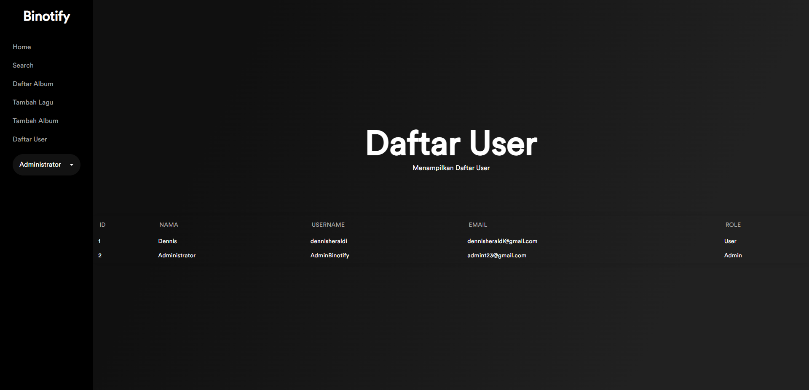

# Binotify: Web App Music Player

## Description

Monolithic PHP & Vanilla Web Application Music Player  
A web-based music application operated using a pure MySQL DBMS and PHP along with HTML, CSS, and vanilla Javascript.

## Requirements

-   docker

## Install

- Ensure [Docker](https://docs.docker.com/engine/install/) is installed.
- Clone the repository.
- Rename the file `.env.example` to `.env`, reconfigure if necessary.

## Run

- Navigate to the project folder.
- Run the command `docker compose up --build -d` via the terminal.

## Screenshots

Register

Login

Home

Detail Lagu

Tambah Lagu

Tambah Album

Daftar User

## Contributor

Server-side:
-   User: 13520103
-   Album: 13520018
-   Lagu: 13520135

Client-side:
-   User: 13520103
-   Album: 13520018
-   Lagu: 13520135

Additional Binotify App:
- DB Update: 13520103
- Endpoint Callback: 13520103
